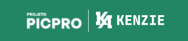

  

<h1 align='center'> PicPro Payment Screen </h1>

	
	
	

_Para a versão em Português, clique [aqui](#portuguese)._

### Topics

- [Project description](#project-description)

- [Technologies used](#technologies-used)

- [What I learned](#what-I-learned)

- [Access the Project](#access-the-project)

## Project description

Project developed for the PicPro event taught by [Kenzie Academy Brasil](https://kenzie.com.br/) instructors in partnership with [PicPay](https://picpay.com/).

## Technologies used

  
  
  

## What I learned

- How to hidde and show a section according to the user's form of payment choice with Javascript function.

## Access the Project

You can [access the project here](https://bo83dev.github.io/picpro-project/) 

Desktop 

<h1 align='center'> Tela de Pagamento PicPro </h1>

	
	
		

### Tópicos 

- [Descrição do projeto](#descrição-do-projeto)

- [Tecnologias utilizadas](#tecnologias-utilizadas)

- [O que aprendi](#o-que-aprendi)

- [Acesse o projeto](#acesse-o-projeto)

## Descrição do projeto 

Projeto desenvolvido para o evento PicPro ministrado pelos instrutores da [Kenzie Academy Brasil](https://kenzie.com.br/) em parceria com o [PicPay](https://picpay.com/).

## Tecnologias utilizadas

  
  
  

## O que aprendi

- Como esconder e mostrar uma seção de acordo com a forma de pagamento escolhida pelo usuário com a função Javascript.

## Acesse o projeto

Você pode [acessar o projeto aqui](https://bo83dev.github.io/picpro-project/) 

Desktop 

Developed with 🧡 by me!  [Carol Vilar](https://www.linkedin.com/in/carolinebarbosavilar/)
